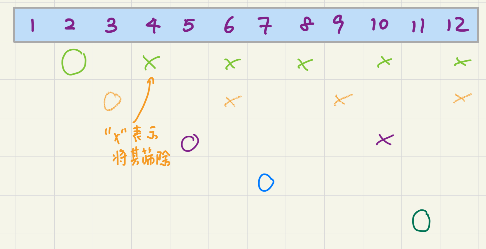

## 运行方式

功能函数在 `src/lib.c` 中定义，执行部分在 `src/getPrime.c` 中定义。

```
mkdir build
cd build
cmake .. && make
./w3
```

输入 $n$，程序会调用逐个判断、两种埃氏筛和欧拉筛四种算法并统计其时间，分别输出结果。当 $n$ 大于 $2000$ 时，求得的答案输出在 `build/result.txt` 中，例子如下：

```
Input a number `n` and the program will output all the prime numbers
between 1 and n in three methods and how much TIME they spent.
`n` should be no more than 30000000. If `n` is greater than 2000, 
stdout will be redirected to result.txt.
40
-----
Executing algorithm: Judge Directly...
Judge Directly spent 0.000009 seconds
2 3 5 7 11 13 17 19 23 29 31 37
-----
Executing algorithm: Plain Eratosthenes Sieve...
Plain Eratosthenes Sieve spent 0.000011 seconds
2 3 5 7 11 13 17 19 23 29 31 37
-----
Executing algorithm: Optimized Eratosthenes Sieve...
Optimized Eratosthenes Sieve spent 0.000010 seconds
2 3 5 7 11 13 17 19 23 29 31 37
-----
Executing algorithm: Eular Sieve...
Eular Sieve spent 0.000014 seconds
2 3 5 7 11 13 17 19 23 29 31 37
```

## 逐个判断法 `print_prime_judge()`

判断一个数 $x$ 是否是素数，可以考虑 $2 到 \sqrt x$ 中是否存在 $x$ 的因数（如果有大于 $\sqrt x$ 的因数 $i$，则 $\dfrac{x}{i}$ 也是 $x$ 的因数而且小于 $\sqrt x$）。从 $1$ 到 $n$ 逐个判断 $x$ 是否是素数并加入答案数组中，时间复杂度为 $\sum_{i = 1}^{n} \sqrt i = O(n \sqrt n)$。

```c
// n 以内素数大致数量 = n / ln(n)
enum { MAX_N = (int)(3e7), MAX_T = MAX_N + 10, MAX_PRIME_NUM = (int)(2e6 + 10) };

// 使用结构体存储计算结果。
typedef struct ResultInner Result;
struct ResultInner {
    int cnt; // 素数个数
    int* primes; // 素数数组
};

/**
 * @brief 判断 x 是否是质数。时间复杂度 $O(\sqrt{x})$
 */
int is_prime(int x) {
    if (x == 1) {
        return 0;
    }
    // 若 x 有非 1 和自身的因数，则必然在 2 ~ sqrt(x) 之间
    // 存在因数。
    int s = sqrt(x);
    for (int i = 2; i <= s; i++) {
        // x % i == 0 即 i 是 x 的因数。
        if (x % i == 0) {
            return 0;
        }
    }
    // 若找不到范围内的因数，则是质数。
    return 1;
}

/**
 * @brief 使用 `is_prime()` 逐个判断 x 是否素数。复杂度为 $O(n ^ 1.5)$
 */
Result print_prime_judge(int n) {
    // 用 static 变量存储求解信息，然后用指针返回结果。
    // 这样做是为了比较算法效率时，避免输出的影响。
    static int cnt = 0;
    static int primes[MAX_PRIME_NUM] = { 0 };
    for (int i = 2; i <= n; i++) {
        if (is_prime(i)) {
            primes[++cnt] = i;
        }
    }
    // 使用 Result 结构体返回得到的总质数个数和质数数组。
    return (Result) { .cnt = cnt, .primes = primes };
}
```

## 朴素埃氏筛法 `print_prime_sieve_eratosthenes_plain()` 

考虑用一个 `uint8_t` 数组 `not_prime[]` 表示 $i$ 是否是素数。接下来考虑将 $2$ 的倍数从数组中筛去（标记为 $1$），然后筛去 $3$ 的倍数，$4$ 的倍数... 以此类推，直到 $\sqrt n$ 的倍数也被筛去。由上面一种算法可知，此时所有合数都被筛去了，剩下的即为素数。


    
时间复杂度为 $\sum_{i = 1}^{\sqrt n} \dfrac{n}{i}$。用调和级数的知识计算得到 $O(n \log n)$。

```c
/**
 * @brief 使用朴素埃氏筛筛去所有合数。复杂度 $\sum_{i = 1}^{\sqrt n} \dfrac{n}{i}$ i = O(n \log n)$
 */
Result print_prime_sieve_eratosthenes_plain(int n) {
    // not_prime[i] = 1 表示该数不是质数
    static uint8_t not_prime[MAX_T] = { 0 };
    static int cnt = 0;
    static int primes[MAX_PRIME_NUM] = { 0 };

    // 1 不是质数。
    not_prime[1] = 1;
    for (int i = 2; i * i <= n; i++) {
        // 对于每个数，标记其倍数为合数即可。
        for (int j = i * 2; j <= n; j += i) {
            not_prime[j] = 1;
        }
    }
    for (int i = 2; i <= n; i++) {
        // 最后未被标记为合数的数加入到结果数组中。
        if (!not_prime[i]) {
            primes[++cnt] = i;
        }
    }
    return (Result) { .cnt = cnt, .primes = primes };
}
```

## 优化埃氏筛 `print_prime_sieve_eratosthenes_optimized()`

在上一中算法中，当我们用合数筛去合数的倍数时，这些倍数已经被这个合数的质因数筛去至少一次了。因此我们只需要在 $i$ 为质数时将其倍数筛去，时间复杂度进一步下降为 $\sum_{p, p \text{ is a prime}, p \leq \sqrt n} \dfrac{n}{p}$。参考 [https://www.zhihu.com/question/35112789](https://www.zhihu.com/question/35112789)，使用质数的调和级数公式得 $O(n \log \log n)$。

```c
/**
 * @brief 使用优化埃氏筛筛去所有合数。复杂度 $O(n \log\log n)$
 */
Result print_prime_sieve_eratosthenes_optimized(int n) {
    // not_prime[i] = 1 表示该数不是质数
    static uint8_t not_prime[MAX_T] = { 0 };
    static int cnt = 0;
    static int primes[MAX_PRIME_NUM] = { 0 };

    not_prime[1] = 1;
    for (int i = 2; i * i <= n; i++) {
        // 对于每个质数（前面筛去后剩下的就是质数），标记其倍数为合数。
        if (!not_prime[i]) {
            for (int j = i * 2; j <= n; j += i) {
                not_prime[j] = 1;
            }
        }
    }
    for (int i = 2; i <= n; i++) {
        if (!not_prime[i]) {
            primes[++cnt] = i;
        }
    }
    return (Result) { .cnt = cnt, .primes = primes };
}
```

## 欧拉筛 `print_prime_sieve_euler()`

欧拉筛可以保证范围内的每个合数都被删掉，而且任一合数只被 **“最小质因数 × 最大因数（非自己） = 这个合数”** 的途径删掉。由于每个数只被筛一次，时间复杂度为 $O(n)$。

```c
/**
 * @brief 使用欧拉筛去所有合数。复杂度 $O(n)$. 证明见 README
 */
Result print_prime_sieve_euler(int n) {
    static uint8_t not_prime_eular[MAX_T] = { 0 };
    // 用 prime_eular 存储确定的质数。
    static int primes[MAX_T] = { 0 };
    static int cnt = 0;

    not_prime_eular[1] = 1;
    for (int i = 2; i <= n; i++) {
        if (!not_prime_eular[i]) { // 没筛掉
            primes[++cnt] = i; // 将 i 加到素数数组里
        }
        for (int j = 1; j <= cnt && i * primes[j] <= n; j++) {
            // 从 primes[1]，即最小质数 2 开始，逐个枚举已知的质数，并期望 primes[j] 是 i * primes[j] 的
            // 最小质因数。当然，i 肯定比 primes[j]大，因为 primes[j] 是在 i 之前得出的。
            not_prime_eular[i * primes[j]] = 1;
            if (i % primes[j] == 0) {
                // i 中也含有 primes[j] 这个因子，则不必往下筛。
                break;
            }
        }
    }
    return (Result) { .cnt = cnt, .primes = primes };
}
```

### 证明所有合数都会被标记

设一合数 $C$（要筛掉）的最小质因数是 $p_1$，令 $B = C / p_1$（$C = B × p_1$），则 $B$ 的最小质因数不小于 $p_1$（否则 $C$ 也有这个更小因子）。那么当外层枚举到 $i = B$ 时，我们将会**从小到大**枚举各个质数；因为 $i = B$ 的最小质因数不小于 $p_1$，所以 $i$ 在质数枚举至 $p_1$ 之前一定不会 `break`，**这回**，$C$ 一定会被 $B × p_i$ 删去。

例：$315 = 3 × 3 × 5 × 7$，其最小质因数是 $3$。考虑 $i = 315 / 3 = 105$ 时，我们从小到大逐个枚举质数，**正是因为** $i$ 的最小质因数**也**不会小于 $3$（本例中就是 $3$），所以当枚举 $j = 1$ `(primes[j] = 2)` 时，$i$ 不包含 $2$ 这个因子，也就**不会 `break`**，直到 `primes[j] = 3` **之后**才退出。

*当然质数不能表示成“**大于1的某数×质数**”，所以整个流程中不会标记。*

### 线性复杂度证明

注意这个算法一直使用“某数×质数”去筛合数，又已经证明一个合数一定会被它的最小质因数 $p_1$ 筛掉，所以我们**唯一要担心的就是同一个合数是否会被“另外某数 × $p_1$ 以外的质数”再筛一次导致浪费时间**。设要筛的合数是 $C$，设再一次筛去它的质数为 $p_x$，再令 $A = C / p_x$，**则 $A$ 中一定有 $p_1$ 这个因子**。当外层枚举到 $i = A$，它想要再筛一次 $C$，却在枚举 $\text{primes}_j = p_1$ 时，因为 $i \mod \text{primes}_j = 0$ 就退出了。因而 $C$ 除了 $p_1$ 以外的质因数都不能筛它。

例：$315 = 3 × 3 × 5 × 7$。首先，虽然看上去有两个 $3$，但我们筛数的唯一一句话就是
```cpp
            not_prime_eular[i * primes[j]] = 1;
```
所以，$315$ 只可能用 $105 × 3$ 或 $63 × 5$ 或 $45 × 7$ 这三次筛**而非四次**。后两个 $i = 63, i = 45$ 都因为**要求对应的质数** `primes[j]` 为 $5$ 、$7$，而**拥有** $3$ 这个因数，因此他们内部根本枚举不到 $5$ 、$7$，而是枚举到 $3$ 就 `break` 了。
